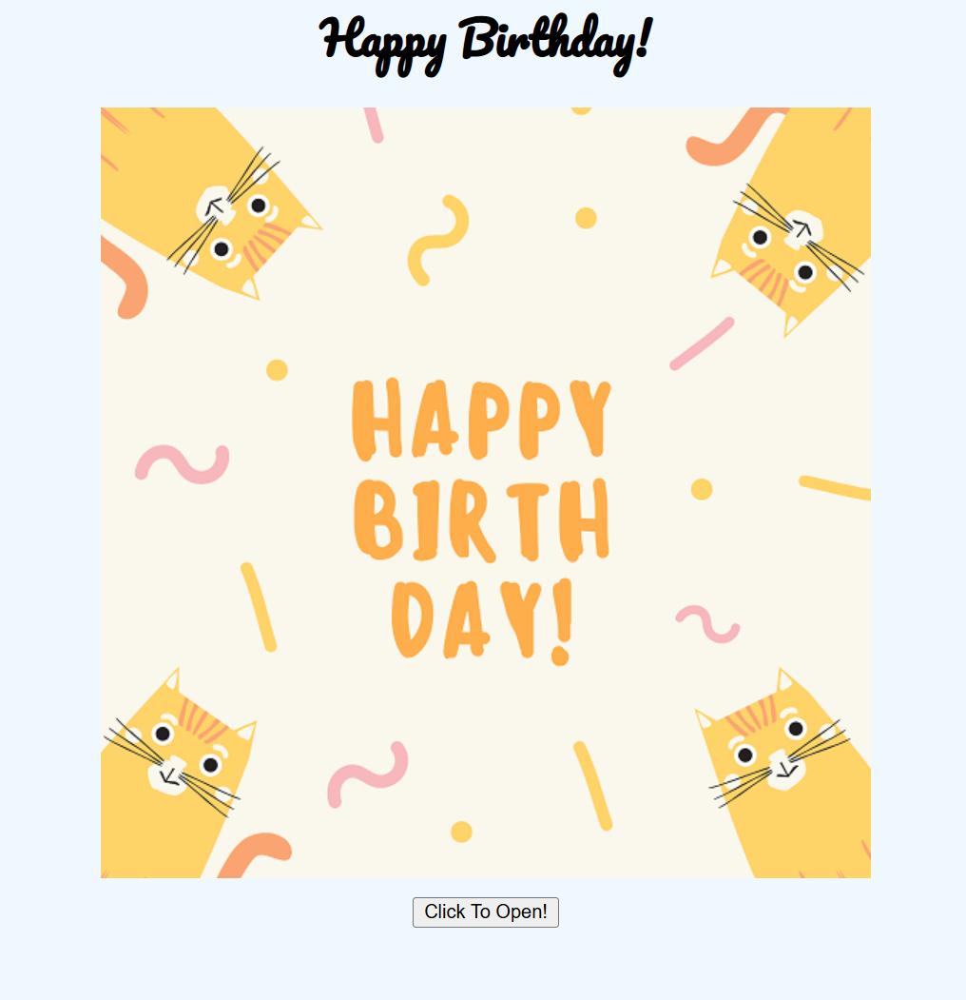

# Happy Birthday Card

A **fun and interactive digital birthday card** built with HTML, CSS, and JavaScript. Users can click to open and close the card, revealing a special birthday message.

---

## Demo

Here’s how the card works:




---

## Features

- Interactive "Click to Open" and "Click to Close" functionality.  
- Smooth 3D rotation animation when opening the card.  
- Personalised birthday message display.  
- Uses a playful font to enhance the festive feel.  
- Fully responsive and works on desktop and mobile screens.

---

## Technologies Used

- HTML5  
- CSS3 (with Google Fonts)  
- JavaScript (ES6)

---

## How It Works

1. The card initially displays a **cover** with "Happy Birthday!" text and a button.  
2. Clicking **"Click To Open!"** rotates the cover, revealing the birthday message.  
3. Clicking **"Click To Close"** closes the card, returning to the cover.  
4. CSS transitions handle smooth rotation animations.  
5. JavaScript toggles the card state by adding or removing a CSS class.

---

## Installation

1. Clone the repository:
```bash
git clone https://github.com/yourusername/happy-birthday-card.git
```
2. Navigate to the project folder:
```bash
cd birthday-card
```
3. Open index.html in your browser.
